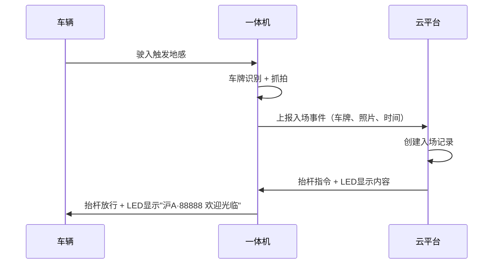
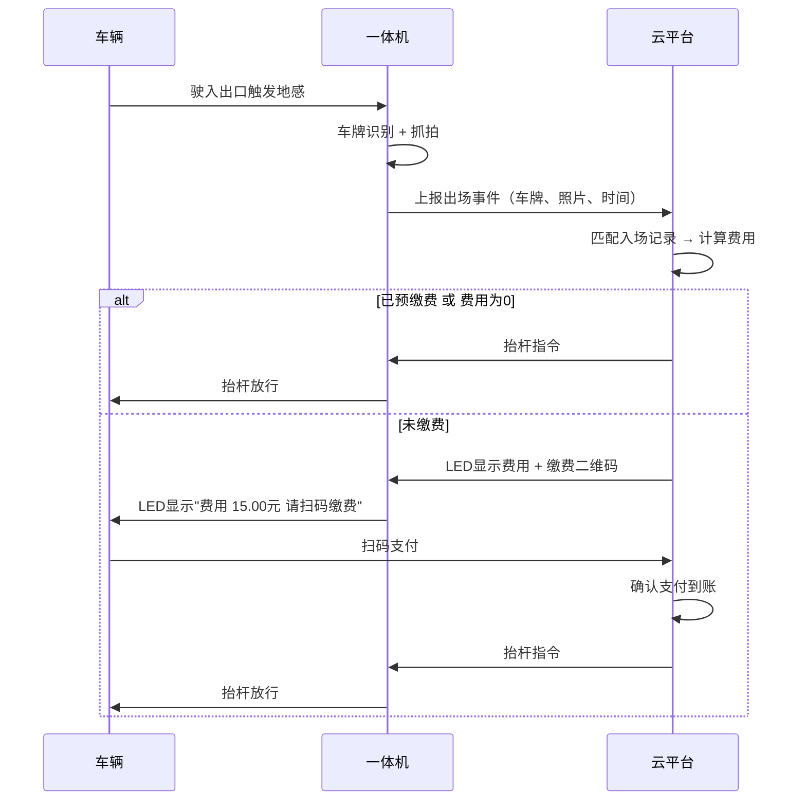
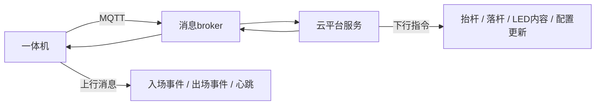

# ParkHub MVP 范围定义（P0）

> 目标：跑通"车辆入场 → 停车 → 缴费 → 出场"的最小业务闭环，支持多租户多车场。

---

## 一、MVP 功能模块

### 1. 多租户 + 多车场管理

**用户故事：** 作为平台管理员，我需要为物业公司开通账号，并让他们自行管理旗下多个停车场。

| 功能点 | 说明 |
|--------|------|
| 租户开通 | 创建租户账号、设置基础信息、分配管理员 |
| 租户列表 | 查看所有租户状态（正常 / 冻结） |
| 停车场创建 | 租户管理员创建车场（名称、地址、总车位数） |
| 出入口配置 | 为车场添加出入口，绑定一体机设备 |
| 实时余位 | 基于出入记录自动计算剩余车位 |

### 2. 车牌识别出入场

**用户故事：** 作为车主，我驾车到达停车场入口，一体机自动识别车牌并抬杆放行。

#### 入场流程



#### 出场流程



#### 异常场景处理

| 异常情况 | 处理方式 |
|----------|----------|
| 车牌识别失败 | 一体机上报异常 → 通知操作员 → 手动录入车牌 |
| 有入无出 | 超过24h未出场标记异常 → 操作员人工核实 |
| 有出无入 | 无匹配入场记录 → 操作员手动补录入场时间并收费 |
| 重复入场 | 同一车牌已在场 → 通知操作员确认 |

### 3. 临停计费 + 扫码缴费

**用户故事：** 作为临停车主，出场时系统自动算费，我扫码支付后自动放行。

| 功能点 | 说明 |
|--------|------|
| 基础计费规则 | MVP 先支持"按小时计费 + 免费时长 + 每日封顶"组合 |
| 费用计算 | 出场时自动触发，精确到分钟 |
| 扫码缴费页面 | H5 页面：显示车牌、入场时间、停车时长、应付金额 |
| 支付渠道 | 微信支付 / 支付宝（MVP 至少接入一种） |
| 缴费后自动放行 | 支付回调 → 更新订单状态 → 下发抬杆指令 |
| 操作员手动收费 | 现场操作员确认收款 → 手动触发放行 |

#### MVP 计费规则（简化版）

```
配置项：
  - 免费时长：N 分钟（默认 15 分钟）
  - 计费单价：X 元/小时
  - 每日封顶：Y 元/24小时

计算逻辑：
  1. 停车时长 = 出场时间 - 入场时间
  2. 计费时长 = max(0, 停车时长 - 免费时长)
  3. 原始费用 = ceil(计费时长 / 60分钟) × 单价
  4. 最终费用 = min(原始费用, 每日封顶 × 天数)
```

### 4. 一体机设备对接

**用户故事：** 作为租户管理员，我需要将现场安装的一体机注册到平台，并实时监控其运行状态。

| 功能点 | 说明 |
|--------|------|
| 设备注册 | 输入设备序列号 → 绑定到指定出入口 |
| 设备列表 | 查看所有设备：序列号、位置、在线状态、最后心跳 |
| 心跳监测 | 设备定时上报心跳（建议 30s 间隔），超时标记离线 |
| 离线告警 | 设备离线超过阈值 → 推送告警通知 |
| 远程抬杆 | 操作员通过平台下发抬杆/落杆指令 |
| 通信协议 | MQTT（推荐）或 HTTP 长轮询 |

#### 设备通信架构



#### MQTT Topic 设计（建议）

```
上行（设备 → 云端）：
  parkhub/{tenantId}/{deviceId}/event/entry     # 入场事件
  parkhub/{tenantId}/{deviceId}/event/exit       # 出场事件
  parkhub/{tenantId}/{deviceId}/heartbeat        # 心跳
  parkhub/{tenantId}/{deviceId}/alarm            # 告警

下行（云端 → 设备）：
  parkhub/{tenantId}/{deviceId}/command/gate     # 抬杆/落杆
  parkhub/{tenantId}/{deviceId}/command/led      # LED显示内容
  parkhub/{tenantId}/{deviceId}/command/config   # 配置更新
```

---

## 二、MVP 页面清单

| 页面 | 所属角色 | 核心功能 |
|------|----------|----------|
| 登录页 | 通用 | 账号密码登录 |
| 租户管理 | 平台管理员 | 租户列表、创建/冻结租户 |
| 停车场管理 | 租户管理员 | 车场列表、出入口配置 |
| 设备管理 | 租户管理员 | 设备列表、在线状态、远程抬杆 |
| 计费规则配置 | 租户管理员 | 设置单价、免费时长、封顶价 |
| 实时监控 | 租户管理员/操作员 | 实时通行记录、在场车辆、余位 |
| 出入记录 | 租户管理员/操作员 | 历史记录查询、异常记录处理 |
| 操作员工作台 | 操作员 | 手动抬杆、手动收费、异常处理 |
| 扫码缴费页 | 车主（H5） | 费用展示、支付 |

---

## 三、MVP 验收标准

- [ ] 租户可自行创建停车场并绑定一体机设备
- [ ] 一体机识别车牌后自动上报，云端记录入场
- [ ] 车辆出场时自动计算停车费用
- [ ] 车主扫码支付后一体机自动抬杆放行
- [ ] 操作员可手动处理异常车辆（手动抬杆、补录）
- [ ] 设备离线时系统发出告警通知
- [ ] 多租户数据完全隔离

---

## 四、后续迭代预告

| 版本 | 新增功能 |
|------|----------|
| **V2** | 月卡/年卡管理、优惠券（金额券）、财务报表 |
| **V3** | 优惠券（时长券/全免券）、商户自助发券、车主小程序 |
