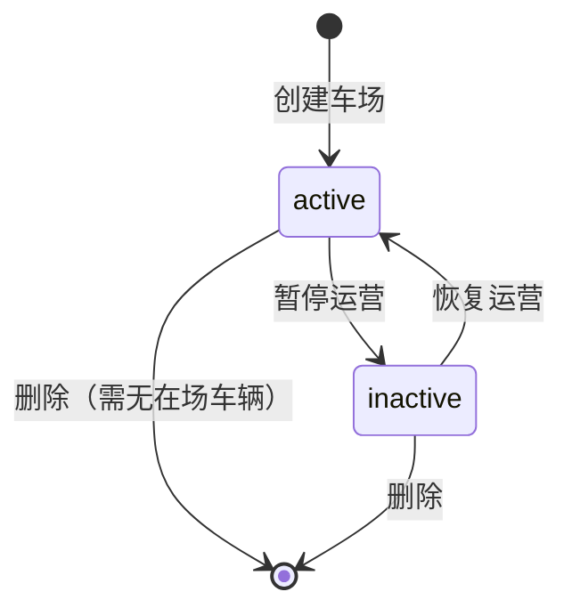

# 停车场管理模块 PRD

> **版本**：v1.0.0
> **状态**：评审中
> **创建日期**：2026-03-17
> **产品经理**：Claude
> **关联设计稿**：[pages/parking-lot.html](../pages/parking-lot.html)
> **关联总 PRD**：[docs/prd-mvp.md](prd-mvp.md) §3.3

---

## 一、模块概述

### 1.1 业务背景

停车场管理是 ParkHub 平台的核心基础模块。一个租户（物业公司）可管理多个停车场，每个停车场拥有多个出入口，每个出入口绑定一台设备。停车场管理模块承担着**车场资产的增删改查**和**出入口拓扑配置**的职责，是计费规则、设备管理、实时监控等上层功能的数据基石。

### 1.2 模块定位

```
租户管理 ──创建租户──→ 停车场管理 ──配置出入口──→ 设备管理 ──绑定设备──→ 运营监控
                        ↑ 本模块                      ↓
                        └──── 计费规则（按车场配置）────┘
```

停车场管理是**租户管理的下游**、**设备管理 / 计费规则 / 出入记录的上游**，属于平台的第二层核心实体。

### 1.3 核心价值

| 用户角色 | 核心价值 |
|----------|----------|
| 租户管理员 | 一站式管理旗下所有车场资产，快速完成出入口拓扑配置，实时掌握各车场运营状态 |
| 平台管理员 | 全局概览所有租户的车场资源分布，辅助运营决策 |
| 操作员（间接） | 依赖车场 + 出入口数据完成抬杆、收费等日常操作 |

---

## 二、用户角色与权限

### 2.1 访问权限

| 功能 | 平台管理员 | 租户管理员 | 操作员 |
|------|:----------:|:----------:|:------:|
| 查看停车场列表 | ✅（全平台） | ✅（本租户） | ❌ |
| 查看停车场详情 | ✅（只读） | ✅ | ❌ |
| 新建停车场 | ❌ | ✅ | ❌ |
| 编辑停车场 | ❌ | ✅ | ❌ |
| 删除停车场 | ❌ | ✅（需确认） | ❌ |
| 配置出入口 | ❌ | ✅ | ❌ |
| 查看出入口状态 | ✅（只读） | ✅ | ❌ |

### 2.2 数据隔离规则

- 租户管理员仅能查看和操作 **本租户** 旗下的停车场
- 平台管理员可跨租户查看所有停车场（只读模式）
- 所有 API 请求必须携带 `tenant_id`，跨租户访问返回 `403 Forbidden`

---

## 三、页面功能规格

### 3.1 页面布局

> **设计稿**：[pages/parking-lot.html](../pages/parking-lot.html)

```
┌──────────────────────────────────────────────────────────────────┐
│ [侧边栏 w-64]  │  [主内容区]                                      │
│                 │  ┌─────────────────────────────────────────────┐ │
│  ParkHub Logo   │  │ Header: 停车场管理                           │ │
│  ─────────────  │  │ 描述 │ 搜索框 │ [新建车场]                   │ │
│  平台管理       │  ├─────────────────────────────────────────────┤ │
│   ├ 租户管理    │  │ 统计卡片区（4列）                             │ │
│  车场运营       │  │ 总车位数 │ 剩余车位 │ 在场车辆 │ 出入口数     │ │
│   ├ 停车场管理✓ │  ├─────────────────────────────────────────────┤ │
│   ├ 设备管理    │  │ 车场卡片列表（2列网格）                       │ │
│   ├ 计费规则    │  │ ┌──────────────┐  ┌──────────────┐          │ │
│  运营监控       │  │ │ 车场卡片 1    │  │ 车场卡片 2    │          │ │
│   ├ 实时监控    │  │ └──────────────┘  └──────────────┘          │ │
│   ├ 出入记录    │  │ ┌──────────────┐  ┌──────────────┐          │ │
│   ├ 操作员台    │  │ │ 车场卡片 3    │  │ 车场卡片 4    │          │ │
│  ─────────────  │  │ └──────────────┘  └──────────────┘          │ │
│  [用户信息]     │  └─────────────────────────────────────────────┘ │
└──────────────────────────────────────────────────────────────────┘
```

### 3.2 统计卡片区

| 卡片ID | 名称 | 数据来源 | 图标 | 图标背景色 | 数值颜色 |
|--------|------|----------|------|-----------|----------|
| SC-001 | 总车位数 | `SUM(parking_lots.total_spaces)` | `fa-square-parking` | `bg-blue-50` | `text-gray-900` |
| SC-002 | 剩余车位 | `SUM(parking_lots.available_spaces)` | `fa-car` | `bg-emerald-50` | `text-emerald-600` |
| SC-003 | 在场车辆 | `总车位 - 剩余车位`（实时计算） | `fa-car-side` | `bg-amber-50` | `text-gray-900` |
| SC-004 | 出入口数 | `COUNT(gates)` | `fa-door-open` | `bg-violet-50` | `text-gray-900` |

**交互规格：**
- 卡片 hover 时轻微上浮（`translateY(-2px)`），阴影增强
- 数据从 API 实时获取，页面加载时显示骨架屏
- 数值使用千位分隔符格式化（如 `8,640`）

### 3.3 车场卡片列表

#### 3.3.1 卡片结构

```
┌─────────────────────────────────────────────────────────┐
│ [渐变图标 w-14]  车场名称                      [状态标签] │
│                  📍 详细地址                               │
├─────────────────────────────────────────────────────────┤
│  ┌──────────┐   ┌──────────┐   ┌──────────┐            │
│  │   800    │   │   156    │   │    6     │            │
│  │  总车位  │   │   剩余   │   │  出入口  │            │
│  └──────────┘   └──────────┘   └──────────┘            │
├─────────────────────────────────────────────────────────┤
│ 使用率                                    80.5%         │
│ [████████████████████░░░░░]                              │
├─────────────────────────────────────────────────────────┤
│ ↙入口 3  ↗出口 3           [配置出入口] | [编辑]        │
└─────────────────────────────────────────────────────────┘
```

#### 3.3.2 组件规格

| 组件ID | 组件名称 | 类型 | 规格说明 |
|--------|----------|------|----------|
| PC-001 | 车场图标 | 图标容器 | `w-14 h-14 rounded-xl`，渐变背景，FontAwesome 图标 |
| PC-002 | 车场名称 | 文本 | `font-semibold text-gray-900 text-base` |
| PC-003 | 车场地址 | 文本 | `text-sm text-gray-500`，前置 `fa-location-dot` 图标 |
| PC-004 | 状态标签 | 标签 | 见下方状态定义 |
| PC-005 | 数据统计块 | 网格 | 3 列等分，居中对齐，各自不同背景色 |
| PC-006 | 使用率进度条 | 进度条 | `h-2 rounded-full`，颜色规则见下方 |
| PC-007 | 底部操作栏 | 工具栏 | 灰色背景 `bg-gray-50`，左侧出入口统计，右侧操作按钮 |

#### 3.3.3 状态标签定义

| 状态值 | 显示文本 | 样式 | 说明 |
|--------|----------|------|------|
| `active` | 运营中 | 绿色背景 `bg-emerald-50 text-emerald-700` + 绿色呼吸点 + 绿色光晕 | 正常运营状态 |
| `inactive` | 暂停运营 | 灰色背景 `bg-gray-100 text-gray-600` + 灰色静态点 | 暂停服务状态 |

**呼吸点动画：**
```css
@keyframes pulse {
  0%, 100% { opacity: 1; }
  50% { opacity: 0.5; }
}
.status-dot { animation: pulse 2s infinite; }
```

#### 3.3.4 使用率进度条颜色规则

| 使用率区间 | 进度条颜色 | 数值文字颜色 | 光晕效果 |
|-----------|-----------|-------------|---------|
| 0% ~ 79.9% | `bg-emerald-500` | `text-emerald-600` | `box-shadow: 0 0 8px rgba(34,197,94,0.3)` |
| 80% ~ 89.9% | `bg-amber-500` | `text-gray-900` | `box-shadow: 0 0 8px rgba(245,158,11,0.3)` |
| 90% ~ 100% | `bg-red-500` | `text-red-600` | `box-shadow: 0 0 8px rgba(239,68,68,0.3)` |
| 暂停运营 | `bg-gray-300` | `text-gray-500` | 无 |

**计算公式：**
```
使用率 = (总车位 - 剩余车位) / 总车位 × 100%
```

#### 3.3.5 卡片图标渐变色方案

设计稿中每个车场使用不同的图标和渐变色，以增强视觉辨识度：

| 序号 | 图标 | 渐变色 | 适用场景 |
|------|------|--------|----------|
| 1 | `fa-building` | `from-blue-500 to-blue-600` | 住宅地下车场 |
| 2 | `fa-shop` | `from-emerald-500 to-emerald-600` | 商业停车场 |
| 3 | `fa-house-chimney` | `from-violet-500 to-violet-600` | 社区停车场 |
| 4 | `fa-hotel` | `from-amber-500 to-amber-600` | 别墅/高端物业 |

> **实现建议**：图标和颜色可根据车场类型自动分配，或由管理员在创建时选择。

### 3.4 搜索功能

| 组件ID | 组件名称 | 规格说明 |
|--------|----------|----------|
| PS-001 | 搜索框 | `w-64 h-10`，placeholder: "搜索车场..."，前置 `fa-search` 图标 |

**搜索行为：**
- 输入防抖：500ms
- 匹配字段：车场名称、车场地址
- 模糊匹配，不区分大小写
- 空搜索词显示全部车场
- 搜索结果实时更新卡片列表
- 无匹配结果时显示空状态："未找到匹配的停车场"

---

## 四、弹窗交互规格

### 4.1 新建车场弹窗

| 属性 | 值 |
|------|-----|
| 触发条件 | 点击 Header 区「新建车场」按钮 |
| 弹窗尺寸 | `max-w-lg`（约 512px） |
| 背景遮罩 | `bg-black/40` + `backdrop-filter: blur(4px)` |
| 关闭方式 | 点击遮罩 / 点击右上角 ✕ / 点击取消按钮 / ESC 键 |

#### 4.1.1 表单字段

| 字段名 | 字段类型 | 是否必填 | 校验规则 | placeholder |
|--------|----------|:--------:|----------|-------------|
| 车场名称 | 文本输入 | ✅ | 2-50 字符 | "如：万科翡翠滨江地下停车场" |
| 车场地址 | 文本输入 | ✅ | 5-100 字符 | "省/市/区/街道/门牌号" |
| 总车位数 | 数字输入 | ✅ | 正整数，1-99999 | "0" |
| 车场类型 | 下拉选择 | 否 | — | 默认"地下停车场" |

**车场类型枚举：**

| 值 | 显示文本 |
|-----|---------|
| `underground` | 地下停车场 |
| `ground` | 地面停车场 |
| `stereo` | 立体车库 |

#### 4.1.2 提交流程

```
1. 前端校验
   ├─ 车场名称为空 → 输入框标红，提示"请输入车场名称"
   ├─ 车场地址为空 → 输入框标红，提示"请输入车场地址"
   ├─ 总车位数为空或≤0 → 提示"请输入有效的车位数"
   └─ 校验通过 → 进入步骤 2

2. 按钮状态变更
   ├─ 「确认创建」按钮显示 loading + "创建中..."
   └─ 禁用所有表单输入和按钮

3. 调用 API：POST /api/v1/parking-lots
   ├─ 成功（201）
   │   ├─ 关闭弹窗
   │   ├─ 刷新车场卡片列表
   │   ├─ 刷新统计卡片数据
   │   └─ Toast（成功）："车场创建成功"
   └─ 失败
       ├─ 409 名称重复 → Toast："该车场名称已存在"
       ├─ 400 参数错误 → Toast："请检查填写内容"
       └─ 500 服务异常 → Toast："创建失败，请稍后重试"
```

### 4.2 编辑车场弹窗

| 属性 | 值 |
|------|-----|
| 触发条件 | 点击卡片底部「编辑」按钮 |
| 弹窗结构 | 复用新建车场弹窗，标题改为"编辑停车场" |
| 数据填充 | 打开时自动填充当前车场数据 |
| 提交按钮 | 文本改为"保存修改" |

#### 4.2.1 编辑字段

| 字段名 | 是否可编辑 | 说明 |
|--------|:----------:|------|
| 车场名称 | ✅ | 可修改 |
| 车场地址 | ✅ | 可修改 |
| 总车位数 | ✅ | 可修改（不得小于当前在场车辆数） |
| 车场类型 | ✅ | 可修改 |
| 运营状态 | ✅ | 新增切换开关：运营中 / 暂停运营 |

#### 4.2.2 特殊校验

- **总车位数校验**：若新车位数 < 当前在场车辆数，提示"车位数不能少于当前在场车辆数（{n}辆）"
- **暂停运营确认**：切换为"暂停运营"时，弹出二次确认："暂停运营后，该车场将停止接受新车辆入场，确认操作？"

#### 4.2.3 提交流程

```
调用 API：PUT /api/v1/parking-lots/{id}
├─ 成功（200）
│   ├─ 关闭弹窗
│   ├─ 更新对应卡片数据
│   └─ Toast："修改已保存"
└─ 失败
    ├─ 409 名称重复 → Toast："该车场名称已存在"
    └─ 其他 → Toast："保存失败，请稍后重试"
```

### 4.3 出入口配置弹窗

| 属性 | 值 |
|------|-----|
| 触发条件 | 点击卡片底部「配置出入口」按钮 |
| 弹窗尺寸 | `max-w-2xl`（约 672px） |
| 弹窗标题 | "出入口配置" + 副标题（车场名称） |

#### 4.3.1 弹窗布局

```
┌─────────────────────────────────────────────────────┐
│ 出入口配置                                           │
│ 万科翡翠滨江地下停车场                        [✕]    │
├─────────────────────────────────────────────────────┤
│ 出入口列表                          [+ 添加出入口]   │
│ ┌─────────────────────────────────────────────────┐ │
│ │ [↙ 入口图标] 1号入口                     [在线] │ │
│ │              绑定设备: PH-DEV-2024-001    [编辑] │ │
│ ├─────────────────────────────────────────────────┤ │
│ │ [↙ 入口图标] 2号入口                     [在线] │ │
│ │              绑定设备: PH-DEV-2024-002    [编辑] │ │
│ ├─────────────────────────────────────────────────┤ │
│ │ [↗ 出口图标] 1号出口                     [在线] │ │
│ │              绑定设备: PH-DEV-2024-003    [编辑] │ │
│ ├─────────────────────────────────────────────────┤ │
│ │ [↗ 出口图标] 2号出口              ⚠️    [离线] │ │
│ │              设备离线 · 最后心跳: 15分钟前 [编辑] │ │
│ └─────────────────────────────────────────────────┘ │
├─────────────────────────────────────────────────────┤
│                                        [完成]        │
└─────────────────────────────────────────────────────┘
```

#### 4.3.2 出入口列表项组件

| 组件ID | 组件名称 | 规格说明 |
|--------|----------|----------|
| GC-001 | 类型图标 | 入口：`fa-arrow-right-to-bracket` 绿色；出口：`fa-arrow-right-from-bracket` 蓝色 |
| GC-002 | 出入口名称 | `font-medium text-gray-900` |
| GC-003 | 设备信息 | 在线：显示设备序列号；离线：红色文字显示 "设备离线 · 最后心跳: {N}分钟前" |
| GC-004 | 状态标签 | 在线：`bg-emerald-50 text-emerald-600`；离线：`bg-red-50 text-red-600` |
| GC-005 | 编辑按钮 | `text-xs text-gray-400 hover:text-gray-600` |

#### 4.3.3 离线设备高亮规则

| 条件 | 样式变化 |
|------|----------|
| 设备在线 | 默认样式 `bg-gray-50 rounded-xl` |
| 设备离线 | 增加 `border border-red-200`，设备信息文字变为 `text-red-500` |
| 最后心跳 > 15分钟 | 红色文字显示最后心跳时间 |

#### 4.3.4 添加出入口

点击「+ 添加出入口」按钮后，在列表底部展开内联表单：

```
┌─────────────────────────────────────────────────────┐
│ 新增出入口                                           │
│ 名称 * [________]  类型 * ○入口 ○出口               │
│ 绑定设备   [下拉选择未绑定设备 ▼]                     │
│                              [取消]  [确认添加]       │
└─────────────────────────────────────────────────────┘
```

| 字段名 | 类型 | 是否必填 | 校验规则 |
|--------|------|:--------:|----------|
| 名称 | 文本输入 | ✅ | 2-20 字符，如"1号入口" |
| 类型 | 单选按钮 | ✅ | `entry`（入口）/ `exit`（出口） |
| 绑定设备 | 下拉选择 | 否 | 仅显示当前车场下未绑定的设备 |

**提交后：**
- 新出入口追加到列表
- 刷新车场卡片中出入口统计数据
- Toast："出入口添加成功"

#### 4.3.5 编辑出入口

点击「编辑」按钮后，该列表项变为编辑模式（内联编辑）：

- 名称变为可编辑输入框
- 设备绑定变为下拉选择
- 出现「保存」和「删除」按钮

**删除出入口：**
- 需二次确认："确认删除该出入口？已绑定的设备将自动解绑。"
- 有未完成的通行记录时禁止删除，提示："该出入口存在未完成的通行记录，无法删除"

---

## 五、数据规格

### 5.1 核心实体

#### 停车场（ParkingLot）

```typescript
interface ParkingLot {
  id: string;                    // UUID
  tenant_id: string;             // 所属租户 ID
  name: string;                  // 车场名称
  address: string;               // 车场地址
  total_spaces: number;          // 总车位数
  available_spaces: number;      // 剩余车位（实时计算）
  lot_type: 'underground' | 'ground' | 'stereo';  // 车场类型
  status: 'active' | 'inactive'; // 运营状态
  created_at: datetime;
  updated_at: datetime;
}
```

#### 出入口（Gate）

```typescript
interface Gate {
  id: string;                    // UUID
  parking_lot_id: string;        // 所属车场 ID
  name: string;                  // 名称，如"1号入口"
  type: 'entry' | 'exit';       // 类型
  device_id: string | null;      // 绑定设备 ID（可为空）
  created_at: datetime;
  updated_at: datetime;
}
```

#### 聚合查询（ParkingLotStats）

```typescript
interface ParkingLotStats {
  total_spaces: number;          // 总车位数汇总
  available_spaces: number;      // 剩余车位汇总
  occupied_vehicles: number;     // 在场车辆汇总
  total_gates: number;           // 出入口总数
}
```

### 5.2 数据库表结构

#### `parking_lots` 表

| 列名 | 类型 | 约束 | 说明 |
|------|------|------|------|
| `id` | `UUID` | PK, DEFAULT gen_random_uuid() | 主键 |
| `tenant_id` | `UUID` | FK → tenants.id, NOT NULL | 所属租户 |
| `name` | `VARCHAR(50)` | NOT NULL | 车场名称 |
| `address` | `VARCHAR(100)` | NOT NULL | 车场地址 |
| `total_spaces` | `INT` | NOT NULL, CHECK > 0 | 总车位数 |
| `lot_type` | `VARCHAR(20)` | NOT NULL, DEFAULT 'underground' | 车场类型 |
| `status` | `VARCHAR(20)` | NOT NULL, DEFAULT 'active' | 运营状态 |
| `created_at` | `TIMESTAMPTZ` | NOT NULL, DEFAULT NOW() | 创建时间 |
| `updated_at` | `TIMESTAMPTZ` | NOT NULL, DEFAULT NOW() | 更新时间 |

**索引：**
- `idx_parking_lots_tenant_id` ON `(tenant_id)`
- `UNIQUE idx_parking_lots_tenant_name` ON `(tenant_id, name)`

#### `gates` 表

| 列名 | 类型 | 约束 | 说明 |
|------|------|------|------|
| `id` | `UUID` | PK, DEFAULT gen_random_uuid() | 主键 |
| `parking_lot_id` | `UUID` | FK → parking_lots.id, NOT NULL | 所属车场 |
| `name` | `VARCHAR(20)` | NOT NULL | 出入口名称 |
| `type` | `VARCHAR(10)` | NOT NULL, CHECK IN ('entry', 'exit') | 类型 |
| `device_id` | `UUID` | FK → devices.id, NULLABLE | 绑定设备 |
| `created_at` | `TIMESTAMPTZ` | NOT NULL, DEFAULT NOW() | 创建时间 |
| `updated_at` | `TIMESTAMPTZ` | NOT NULL, DEFAULT NOW() | 更新时间 |

**索引：**
- `idx_gates_parking_lot_id` ON `(parking_lot_id)`
- `UNIQUE idx_gates_lot_name` ON `(parking_lot_id, name)`

---

## 六、API 接口规格

### 6.1 接口总览

| 方法 | 路径 | 说明 | 角色权限 |
|------|------|------|----------|
| `GET` | `/api/v1/parking-lots` | 获取车场列表 | 平台管理员、租户管理员 |
| `GET` | `/api/v1/parking-lots/stats` | 获取统计数据 | 平台管理员、租户管理员 |
| `GET` | `/api/v1/parking-lots/{id}` | 获取车场详情 | 平台管理员、租户管理员 |
| `POST` | `/api/v1/parking-lots` | 新建车场 | 租户管理员 |
| `PUT` | `/api/v1/parking-lots/{id}` | 编辑车场 | 租户管理员 |
| `DELETE` | `/api/v1/parking-lots/{id}` | 删除车场 | 租户管理员 |
| `GET` | `/api/v1/parking-lots/{id}/gates` | 获取出入口列表 | 平台管理员、租户管理员 |
| `POST` | `/api/v1/parking-lots/{id}/gates` | 添加出入口 | 租户管理员 |
| `PUT` | `/api/v1/gates/{id}` | 编辑出入口 | 租户管理员 |
| `DELETE` | `/api/v1/gates/{id}` | 删除出入口 | 租户管理员 |

### 6.2 接口详细定义

#### 6.2.1 获取车场列表

```
GET /api/v1/parking-lots?search={keyword}&status={status}&page={page}&page_size={size}
```

**请求参数：**

| 参数 | 类型 | 必填 | 说明 |
|------|------|:----:|------|
| `search` | string | 否 | 模糊搜索（名称、地址） |
| `status` | string | 否 | 筛选状态：`active` / `inactive` |
| `page` | int | 否 | 页码，默认 1 |
| `page_size` | int | 否 | 每页数量，默认 20，最大 100 |

**响应 200：**

```json
{
  "code": 0,
  "message": "success",
  "data": {
    "items": [
      {
        "id": "uuid-xxx",
        "name": "万科翡翠滨江地下停车场",
        "address": "上海市浦东新区陆家嘴环路1000号",
        "total_spaces": 800,
        "available_spaces": 156,
        "lot_type": "underground",
        "status": "active",
        "entry_count": 3,
        "exit_count": 3,
        "usage_rate": 80.5,
        "created_at": "2026-01-15T08:30:00Z",
        "updated_at": "2026-03-17T10:00:00Z"
      }
    ],
    "total": 4,
    "page": 1,
    "page_size": 20
  }
}
```

#### 6.2.2 获取统计数据

```
GET /api/v1/parking-lots/stats
```

**响应 200：**

```json
{
  "code": 0,
  "message": "success",
  "data": {
    "total_spaces": 8640,
    "available_spaces": 2156,
    "occupied_vehicles": 6484,
    "total_gates": 96
  }
}
```

#### 6.2.3 新建车场

```
POST /api/v1/parking-lots
```

**请求体：**

```json
{
  "name": "万科翡翠滨江地下停车场",
  "address": "上海市浦东新区陆家嘴环路1000号",
  "total_spaces": 800,
  "lot_type": "underground"
}
```

**响应 201：**

```json
{
  "code": 0,
  "message": "车场创建成功",
  "data": {
    "id": "uuid-xxx",
    "name": "万科翡翠滨江地下停车场",
    "address": "上海市浦东新区陆家嘴环路1000号",
    "total_spaces": 800,
    "available_spaces": 800,
    "lot_type": "underground",
    "status": "active",
    "created_at": "2026-03-17T10:00:00Z"
  }
}
```

**错误响应：**

| 状态码 | code | message | 触发条件 |
|--------|------|---------|----------|
| 400 | 40001 | "车场名称不能为空" | 必填字段缺失 |
| 400 | 40002 | "车位数必须大于0" | 车位数无效 |
| 409 | 40901 | "该车场名称已存在" | 同租户下名称重复 |

#### 6.2.4 编辑车场

```
PUT /api/v1/parking-lots/{id}
```

**请求体：**

```json
{
  "name": "万科翡翠滨江地下停车场（新）",
  "address": "上海市浦东新区陆家嘴环路1000号",
  "total_spaces": 900,
  "lot_type": "underground",
  "status": "active"
}
```

**错误响应：**

| 状态码 | code | message | 触发条件 |
|--------|------|---------|----------|
| 400 | 40003 | "车位数不能少于当前在场车辆数" | `total_spaces < occupied` |
| 404 | 40401 | "停车场不存在" | ID 无效 |
| 403 | 40301 | "无权操作该停车场" | 跨租户访问 |

#### 6.2.5 删除车场

```
DELETE /api/v1/parking-lots/{id}
```

**前置校验：**
- 车场下存在在场车辆 → 403，message: "该车场存在在场车辆，无法删除"
- 车场下存在未处理异常记录 → 403，message: "该车场存在未处理的异常记录，无法删除"

**响应 200：**

```json
{
  "code": 0,
  "message": "删除成功"
}
```

#### 6.2.6 获取出入口列表

```
GET /api/v1/parking-lots/{id}/gates
```

**响应 200：**

```json
{
  "code": 0,
  "message": "success",
  "data": [
    {
      "id": "gate-uuid-001",
      "name": "1号入口",
      "type": "entry",
      "device": {
        "id": "device-uuid-001",
        "serial_number": "PH-DEV-2024-001",
        "status": "online",
        "last_heartbeat": "2026-03-17T10:02:30Z"
      }
    },
    {
      "id": "gate-uuid-004",
      "name": "2号出口",
      "type": "exit",
      "device": {
        "id": "device-uuid-004",
        "serial_number": "PH-DEV-2024-004",
        "status": "offline",
        "last_heartbeat": "2026-03-17T09:47:00Z"
      }
    }
  ]
}
```

#### 6.2.7 添加出入口

```
POST /api/v1/parking-lots/{id}/gates
```

**请求体：**

```json
{
  "name": "3号入口",
  "type": "entry",
  "device_id": "device-uuid-005"
}
```

#### 6.2.8 编辑出入口

```
PUT /api/v1/gates/{id}
```

**请求体：**

```json
{
  "name": "3号入口（改）",
  "device_id": "device-uuid-006"
}
```

#### 6.2.9 删除出入口

```
DELETE /api/v1/gates/{id}
```

**前置校验：**
- 该出入口存在未完成通行记录 → 403，message: "该出入口存在未完成的通行记录，无法删除"

---

## 七、业务规则

### 7.1 车场生命周期



### 7.2 剩余车位计算规则

```
available_spaces = total_spaces - COUNT(在场车辆)

在场车辆定义：
  type = 'entry' 且 status = 'normal' 且无匹配出场记录
```

- 剩余车位 ≤ 0 时，设备端自动显示"车位已满"
- 剩余车位实时更新（车辆入场 -1，出场 +1）
- 手动修改 `total_spaces` 后立即重新计算

### 7.3 出入口约束

- 每个车场至少保留 1 个入口和 1 个出口（删除时校验）
- 一个设备只能绑定到一个出入口
- 出入口解绑设备后，设备变为"未绑定"状态，可被其他出入口选择
- 出入口名称在同一车场内唯一

### 7.4 暂停运营规则

暂停运营后：
- 车场卡片状态标签变为灰色"暂停运营"
- 使用率进度条变为灰色
- 设备端停止接受新车辆入场
- 已在场车辆仍可正常出场和缴费
- 出入口配置仍可编辑

---

## 八、功能需求清单

### 8.1 功能需求（Functional Requirements）

| ID | 优先级 | 需求描述 | 验收标准 |
|----|:------:|----------|----------|
| FR-PL-001 | MUST | 租户管理员可查看本租户旗下所有停车场的卡片列表 | 1. 列表按创建时间倒序排列；2. 正确显示名称、地址、车位统计、使用率、出入口数；3. 数据隔离正确 |
| FR-PL-002 | MUST | 页面顶部展示汇总统计卡片（总车位、剩余车位、在场车辆、出入口数） | 1. 数据实时从 API 获取；2. 数值使用千位分隔符；3. 页面加载时显示骨架屏 |
| FR-PL-003 | MUST | 租户管理员可新建停车场 | 1. 点击按钮弹出表单；2. 必填项校验完整；3. 同租户名称唯一；4. 创建成功刷新列表 |
| FR-PL-004 | MUST | 租户管理员可编辑停车场信息 | 1. 数据正确回填；2. 修改总车位数时校验不少于在场车辆数；3. 保存成功更新卡片 |
| FR-PL-005 | MUST | 租户管理员可切换停车场运营状态（运营中 / 暂停运营） | 1. 切换需二次确认；2. 暂停后状态标签和进度条样式变更；3. 暂停后设备端停止接受入场 |
| FR-PL-006 | MUST | 使用率进度条根据百分比自动变色（绿/黄/红） | 1. <80% 绿色；2. 80%-90% 黄色；3. >90% 红色；4. 暂停运营灰色 |
| FR-PL-007 | MUST | 租户管理员可查看和配置出入口列表 | 1. 正确区分入口和出口图标/颜色；2. 显示绑定设备和在线状态；3. 离线设备红色高亮 |
| FR-PL-008 | MUST | 租户管理员可添加出入口并绑定设备 | 1. 支持选择类型（入口/出口）；2. 设备下拉仅显示未绑定设备；3. 添加成功刷新列表 |
| FR-PL-009 | MUST | 租户管理员可编辑和删除出入口 | 1. 编辑支持修改名称和重新绑定设备；2. 删除需二次确认；3. 有未完成记录时禁止删除 |
| FR-PL-010 | SHOULD | 支持按车场名称和地址搜索（防抖 500ms） | 1. 模糊匹配正确；2. 空搜索显示全部；3. 无结果显示空状态提示 |
| FR-PL-011 | SHOULD | 平台管理员可跨租户查看所有停车场（只读） | 1. 不显示新建/编辑/删除按钮；2. 统计数据为全平台汇总 |
| FR-PL-012 | COULD | 删除停车场功能 | 1. 需二次确认；2. 有在场车辆或未处理异常时禁止删除；3. 级联删除出入口 |

### 8.2 非功能需求（Non-Functional Requirements）

| ID | 优先级 | 需求描述 | 指标 |
|----|:------:|----------|------|
| NFR-PL-001 | MUST | 车场列表 API 响应时间 | P95 < 500ms |
| NFR-PL-002 | MUST | 统计数据 API 响应时间 | P95 < 300ms |
| NFR-PL-003 | MUST | 页面首屏加载时间 | < 2s |
| NFR-PL-004 | MUST | 多租户数据隔离 | 跨租户访问 100% 返回 403 |
| NFR-PL-005 | SHOULD | 卡片列表支持分页 | 单页最多 20 个车场，支持翻页 |
| NFR-PL-006 | SHOULD | 剩余车位数据时效性 | 延迟 < 5s |

---

## 九、Epic 与用户故事

### Epic 1：停车场 CRUD

**业务价值**：使租户管理员能够管理旗下车场资产，建立车场基础数据

| 故事 ID | 用户故事 | 故事点 |
|---------|----------|:------:|
| US-PL-001 | 作为租户管理员，我想查看本租户所有车场的概览信息，以便了解整体运营状况 | 5 |
| US-PL-002 | 作为租户管理员，我想新建一个停车场，以便将新接管的车场纳入平台管理 | 3 |
| US-PL-003 | 作为租户管理员，我想编辑停车场信息，以便在车场扩建或信息变更时及时更新 | 3 |
| US-PL-004 | 作为租户管理员，我想暂停/恢复停车场运营，以便在车场维护期间停止服务 | 2 |
| US-PL-005 | 作为租户管理员，我想搜索特定的停车场，以便在管理多个车场时快速定位 | 2 |

### Epic 2：出入口配置

**业务价值**：使租户管理员能够配置车场出入口拓扑，为设备绑定和通行管理奠定基础

| 故事 ID | 用户故事 | 故事点 |
|---------|----------|:------:|
| US-PL-006 | 作为租户管理员，我想查看车场所有出入口及其设备状态，以便掌握设备运行情况 | 3 |
| US-PL-007 | 作为租户管理员，我想添加新的出入口并绑定设备，以便在车场新增通道时配置系统 | 3 |
| US-PL-008 | 作为租户管理员，我想编辑出入口信息和重新绑定设备，以便在设备更换时调整配置 | 2 |
| US-PL-009 | 作为租户管理员，我想删除不再使用的出入口，以便保持配置的准确性 | 2 |

### Epic 3：统计与监控

**业务价值**：提供实时的车场运营数据概览，辅助管理决策

| 故事 ID | 用户故事 | 故事点 |
|---------|----------|:------:|
| US-PL-010 | 作为租户管理员，我想在页面顶部看到汇总统计数据，以便快速了解整体车位使用情况 | 2 |
| US-PL-011 | 作为租户管理员，我想通过使用率进度条直观判断各车场的饱和度，以便在高峰期做出调度决策 | 1 |

---

## 十、依赖与约束

### 10.1 上游依赖

| 依赖项 | 说明 | 当前状态 |
|--------|------|----------|
| 租户管理模块 | 车场必须关联到已存在的租户 | ✅ 已实现 |
| 用户认证模块 | JWT 认证 + 角色鉴权 | ✅ 已实现 |
| RBAC 中间件 | 角色权限控制 | ✅ 已实现 |
| 多租户中间件 | 数据隔离 | ✅ 已实现 |

### 10.2 下游影响

| 依赖方 | 影响说明 |
|--------|----------|
| 设备管理模块 | 设备注册时需选择车场和出入口 |
| 计费规则模块 | 计费规则按车场维度配置 |
| 实时监控模块 | 车场余位数据来源于本模块 |
| 出入记录模块 | 通行记录关联车场和出入口 |
| 操作员工作台 | 手动抬杆时需选择车场和出入口 |
| 扫码缴费页 | 费用计算依赖车场的计费规则 |

### 10.3 技术约束

- 前端使用 Next.js 15 App Router + shadcn/ui 组件库
- 后端使用 Go + Gin 框架 + Wire 依赖注入
- 数据库使用 PostgreSQL
- 遵循清洁架构：Domain → Repository → Service → Handler

---

## 十一、实现优先级建议

基于 MoSCoW 分析和依赖关系，建议按以下顺序实现：

```
Phase 1（MUST - 核心闭环）
├── 数据库迁移：创建 parking_lots 和 gates 表
├── 后端：ParkingLot + Gate 完整 CRUD API
├── 前端：车场卡片列表 + 统计卡片
├── 前端：新建车场弹窗
└── 前端：出入口配置弹窗

Phase 2（SHOULD - 体验增强）
├── 搜索功能
├── 编辑车场弹窗
├── 运营状态切换
├── 平台管理员只读模式
└── 骨架屏 + 加载动画

Phase 3（COULD - 锦上添花）
├── 删除车场功能
├── 卡片图标/颜色自定义
└── 车场列表分页
```

---

## 十二、验收标准

### 12.1 功能验收

- [ ] 租户管理员可查看本租户所有停车场卡片列表
- [ ] 统计卡片正确展示汇总数据
- [ ] 可成功新建停车场（含表单校验）
- [ ] 可成功编辑停车场信息
- [ ] 可切换停车场运营状态（含二次确认）
- [ ] 使用率进度条颜色符合规则（绿/黄/红/灰）
- [ ] 出入口配置弹窗正确展示出入口列表
- [ ] 可添加/编辑/删除出入口
- [ ] 离线设备红色高亮显示
- [ ] 搜索功能正常工作（防抖 + 模糊匹配）
- [ ] 多租户数据隔离正确（跨租户返回 403）

### 12.2 设计还原验收

- [ ] 页面布局与 [parking-lot.html](../pages/parking-lot.html) 设计稿一致
- [ ] 卡片 hover 上浮 + 阴影增强效果
- [ ] 状态标签呼吸点动画
- [ ] 进度条颜色渐变和光晕效果
- [ ] 弹窗遮罩模糊效果

---

**文档结束**

*本 PRD 基于 [MVP PRD §3.3](prd-mvp.md) 和 [parking-lot.html](../pages/parking-lot.html) 设计稿细化编写。*
