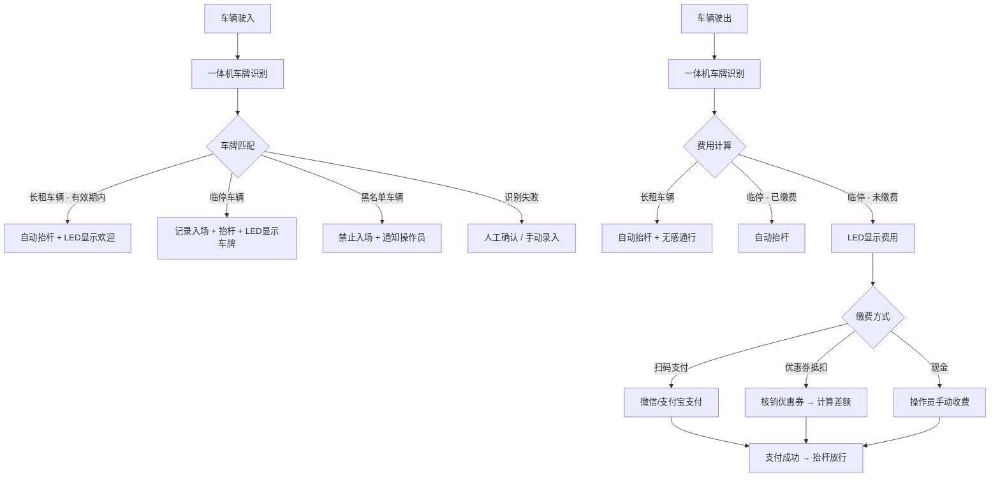

# ParkHub — 智慧停车 SaaS 平台产品方案

## 产品定位

**ParkHub** — 面向物业公司与商业综合体的多租户智慧停车 SaaS 平台，提供车辆出入管理、灵活计费、会员卡务、优惠券核销及一体机设备联动的一站式解决方案。

---

## 一、用户角色矩阵

| 角色 | 描述 | 核心诉求 |
|------|------|----------|
| **平台管理员** | ParkHub 运营方 | 租户管理、平台运营数据、计费模板管理 |
| **租户管理员** | 物业公司 / 商场管理方 | 停车场配置、财务报表、设备监控 |
| **停车场操作员** | 现场值班人员 | 异常车辆处理、手动抬杆、现场收费 |
| **车主（临停）** | 临时停车用户 | 快速入场、扫码缴费、无感出场 |
| **车主（长租）** | 月卡/年卡用户 | 无感通行、续费管理、余额查询 |
| **商户** | 商场内店铺 | 发放/核销停车优惠券 |

---

## 二、核心业务流程

### 车辆出入场主流程



### 优惠券生命周期


---

## 三、信息架构（IA）

```
ParkHub SaaS
├── 🏢 平台管理（超管）
│   ├── 租户管理（开通 / 冻结 / 配额）
│   ├── 计费模板库（预设多种计费规则供租户选用）
│   ├── 平台数据大盘
│   └── 系统设置
│
├── 🅿️ 租户工作台
│   ├── 停车场管理
│   │   ├── 车场信息（名称、地址、车位数、营业时间）
│   │   ├── 出入口配置（绑定一体机设备）
│   │   └── 车位态势（实时余位）
│   │
│   ├── 计费管理
│   │   ├── 计费规则配置（多段计费 / 阶梯费率 / 封顶价）
│   │   ├── 免费时长设置
│   │   └── 特殊时段费率（节假日 / 夜间）
│   │
│   ├── 卡务中心
│   │   ├── 月卡 / 年卡套餐管理
│   │   ├── 长租用户管理（开卡 / 续费 / 冻结）
│   │   └── 车牌绑定（支持一卡多车 / 一车多卡）
│   │
│   ├── 优惠券中心
│   │   ├── 优惠券模板（金额券 / 时长券 / 全免券）
│   │   ├── 商户额度分配
│   │   ├── 核销记录
│   │   └── 商户结算
│   │
│   ├── 出入记录
│   │   ├── 实时通行记录（车牌 / 入场照片 / 时间）
│   │   ├── 在场车辆
│   │   ├── 异常记录（有入无出 / 有出无入 / 识别失败）
│   │   └── 手动匹配 / 补录
│   │
│   ├── 财务中心
│   │   ├── 收费流水（临停 / 续卡 / 优惠券抵扣明细）
│   │   ├── 日报 / 月报
│   │   └── 对账与导出
│   │
│   ├── 设备管理
│   │   ├── 一体机列表（在线状态 / 心跳监测）
│   │   ├── 远程控制（抬杆 / 落杆 / 重启）
│   │   └── 告警记录（离线 / 故障）
│   │
│   └── 系统设置
│       ├── 操作员账号管理
│       ├── 角色权限配置
│       └── 通知设置（告警推送渠道）
│
└── 📱 车主端（H5 / 小程序）
    ├── 扫码缴费
    ├── 我的优惠券
    ├── 月卡 / 年卡续费
    └── 停车记录查询
```

---

## 四、MVP 功能优先级

| 优先级 | 功能模块 | 用户价值 | MVP 范围 |
|--------|----------|----------|----------|
| **P0** | 车牌识别出入场 | 基础通行闭环 | ✅ |
| **P0** | 临停计费 + 扫码缴费 | 核心收入场景 | ✅ |
| **P0** | 一体机设备对接 | 硬件联动基础 | ✅ |
| **P0** | 多租户 + 多车场 | SaaS 基础架构 | ✅ |
| **P1** | 月卡/年卡管理 | 长租用户留存 | ✅ |
| **P1** | 出入记录 + 异常处理 | 运营可追溯 | ✅ |
| **P1** | 设备在线监控 | 运维保障 | ✅ |
| **P2** | 优惠券（金额券） | 商业转化 | V2 |
| **P2** | 财务报表 | 经营决策 | V2 |
| **P3** | 优惠券（时长券/全免券） | 场景丰富 | V3 |
| **P3** | 商户自助发券 | 降低运营成本 | V3 |
| **P3** | 车主小程序 | 用户体验提升 | V3 |

---

## 五、计费引擎核心逻辑

这是整个系统的**利润核心**，需要支持以下模式的自由组合：

| 计费模式 | 说明 | 示例 |
|----------|------|------|
| **按时段计费** | 不同时段不同费率 | 白天 5元/h，夜间 2元/h |
| **阶梯计费** | 停车越久单价递减 | 前2h 10元/h，之后 5元/h |
| **按次计费** | 固定收费 | 每次 20元 |
| **封顶计费** | 设置日/夜最高费用 | 白天最高 40元，24h 最高 60元 |
| **免费时长** | 入场后一段时间免费 | 前 15 分钟免费 |
| **优惠券抵扣** | 在最终费用上抵扣 | 金额券减 10元 / 时长券免 2小时 |

### 计费计算流程

```mermaid
flowchart TD
    A[出场触发计费] --> B[获取入场时间]
    B --> C[计算停车时长]
    C --> D[匹配计费规则]
    D --> E{是否有免费时长?}
    E -->|是| F[扣除免费时长]
    E -->|否| G[按规则计算费用]
    F --> G
    G --> H{是否有封顶?}
    H -->|是| I[取 min(计算费用, 封顶价)]
    H -->|否| J[得到应付金额]
    I --> J
    J --> K{是否使用优惠券?}
    K -->|是| L[抵扣优惠券金额]
    K -->|否| M[最终应付金额]
    L --> M
```

---

## 六、待深入讨论

1. **计费规则配置交互**：如何让租户管理员直观地配置复杂计费规则？
2. **优惠券发放渠道**：商户扫码发？系统自动发？API 对接？
3. **优惠券结算逻辑**：商户预充值扣减 vs 月末对账结算？
4. **一体机通信协议**：HTTP / MQTT / 私有协议？
5. **异常场景兜底**：断网离线时如何保证车辆正常通行？
