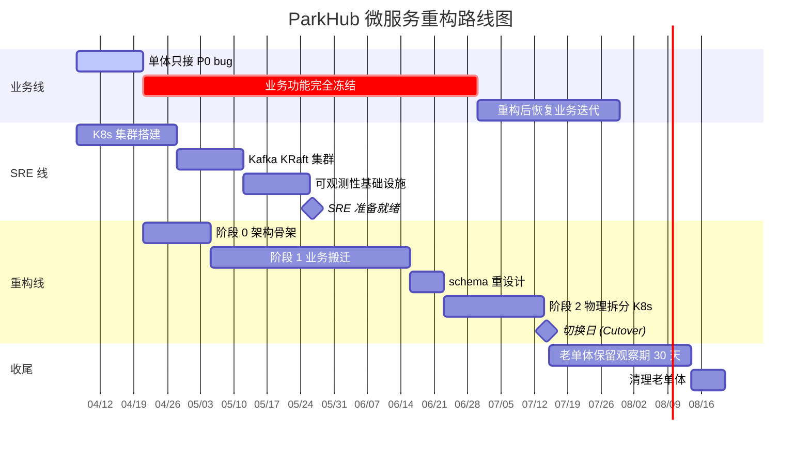

# ParkHub 微服务重构总览

> ParkHub 从单体架构重构为微服务架构的总览文档。
> 决策依据见 [ADR-0001](../adr/0001-migrate-to-microservices.md)。

## 一、文档导航

| 文档 | 用途 | 何时阅读 |
|------|------|---------|
| [ADR-0001](../adr/0001-migrate-to-microservices.md) | 架构决策记录 | 入职第一天必读 |
| [target-architecture.md](./target-architecture.md) | 目标架构详述 | 写代码前必读 |
| [do-not-list.md](./do-not-list.md) | 「不做什么」清单 | 每天提 PR 前重温 |
| [phase-0-skeleton.md](./phase-0-skeleton.md) | 阶段 0 任务清单 | 阶段 0 期间 |
| [phase-1-migration.md](./phase-1-migration.md) | 阶段 1 任务清单 | 阶段 1 期间 |
| [phase-2-k8s.md](./phase-2-k8s.md) | 阶段 2 任务清单 | 阶段 2 期间 |

## 二、为什么要重构？

简短版（详细背景见 ADR-0001）：

1. **团队协作瓶颈**：单仓库 PR 冲突、发布相互阻塞
2. **流量倍增预期**：MVP 已结束，业务即将放量

**关键前提**：
- ✅ MVP 数据均为测试数据，可重设计
- ✅ 业务方承诺重构期功能冻结
- ✅ 前端跟随重构
- ✅ SRE 专人就绪

## 三、重构是什么？不是什么？

| 是 | 不是 |
|----|------|
| ✅ 把单体重组为目标架构 | ❌ 推倒重写所有业务代码 |
| ✅ 保留已验证的业务逻辑 | ❌ 顺手做"代码美化" |
| ✅ 严格按 ADR 执行 | ❌ 边做边发明新设计 |
| ✅ 渐进式验证（单进程 → 多进程） | ❌ Big Bang Rewrite |

## 四、整体路线图

**关键时间节点**：

| 节点 | 日期 | 标志 |
|------|------|------|
| 准备期开始 | 2026-04-07 | 文档冻结、SRE 启动 |
| 功能冻结生效 | 2026-04-21 | 业务方签字、阶段 0 启动 |
| 阶段 0 验收 | 2026-05-05 | 骨架可运行 + 租户 POC 通过 |
| 阶段 1 完成 | 2026-06-16 | 5 个 domain 全部搬完 |
| schema 重设计完成 | 2026-06-23 | 分区表、JSON 列等就位 |
| 阶段 2 完成 | 2026-07-14 | K8s 多服务部署就绪 |
| **切换日** | **2026-07-15** | **流量切到新架构** |
| 老单体下线 | 2026-08-15 | 30 天观察期结束 |

## 五、阶段一览

### 阶段 0：架构骨架搭建（约 2 周）

**目标**：在新分支搭好目标架构的"空壳"，验证关键技术决策。

**关键产出**：
- `internal/domains/*` 目录结构
- 所有 domain 的 proto 定义（先写接口）
- `cmd/monolith` 单进程多 domain 入口
- ORM 租户中间件 + Linter
- OpenTelemetry + VictoriaMetrics + Grafana 基础设施
- **租户隔离 POC 验证通过**

**结束标志**：空壳能启动、proto 通过 lint、租户 POC 全绿

详见 [phase-0-skeleton.md](./phase-0-skeleton.md)

---

### 阶段 1：业务逻辑搬迁（约 6 周）

**目标**：按依赖倒序，把每个 domain 的业务逻辑搬到新架构。

**搬迁顺序**：
1. `core`（其他 domain 都依赖它）
2. `iot`
3. `event`
4. `billing`
5. `payment`
6. `bff`（聚合层最后做）

**搬迁纪律**：
- 每个 domain 一个独立分支：`refactor/phase-1/<domain>`
- 完成验收后再开下一个
- **保留业务规则原样，禁止顺手优化**

**结束标志**：所有 domain 在 `cmd/monolith` 单进程内通过端到端测试

详见 [phase-1-migration.md](./phase-1-migration.md)

---

### 阶段 2：物理拆分 + K8s 部署（约 3 周）

**目标**：把单进程拆成多进程，部署到 K8s，引入 Kafka。

**关键变更**：
- 每个 domain 独立 `cmd/<domain>` 启动入口
- 每个 domain 独立 Dockerfile / 镜像
- 每个 domain 独立 K8s Deployment
- gRPC 调用从 in-process 切到 K8s Service DNS
- 引入 Kafka 取代 in-process 事件总线
- BFF 层独立部署，前端流量切到 BFF

**结束标志**：K8s 上多服务跑通端到端测试 + 完整链路追踪可见

详见 [phase-2-k8s.md](./phase-2-k8s.md)

## 六、组织保障

### 6.1 角色分工

| 角色 | 职责 |
|------|------|
| **架构组** | ADR 维护、PR review、关键决策 |
| **后端开发** | 阶段 0/1/2 主要执行者 |
| **前端开发** | 跟随阶段 1，重构 parkhub-web 调用 BFF |
| **SRE** | K8s、Kafka、可观测性基础设施搭建 |
| **PM** | 守住功能冻结防线、协调业务方 |
| **QA** | 编写端到端集成测试、阶段验收 |

### 6.2 沟通机制

| 形式 | 频率 | 议题 |
|------|------|------|
| 重构站会 | 每日 15min | 进度、阻塞、下一步 |
| 阶段验收会 | 每阶段结束 | 验收 checklist + 问题复盘 |
| 重构周报 | 每周 | 进度、风险、决策记录 |
| 架构组评审会 | 每周 | PR 复审、技术决策 |

### 6.3 决策记录

- 任何重大技术决策必须落到 ADR
- ADR 编号顺序递增
- ADR 状态流转：Proposed → Accepted → Deprecated / Superseded

## 七、风险与缓解（精简版）

| 风险 | 缓解 |
|------|------|
| 业务方中途要求加功能 | 功能冻结提前签字 + PM 把关 |
| 团队信心低谷期 | ADR + 阶段里程碑 + 允许停在阶段 1 |
| 切换日生产事故 | 老单体保留 30 天 + DNS 回滚 |
| ORM 中间件被绕过 | Linter + 单测 + Code Review 三层防御 |
| K8s 基础设施未就绪 | SRE 独立流水线，阶段 1 末期硬性要求 |
| 顺手优化引入 bug | 严格遵守 [do-not-list.md](./do-not-list.md) |

详见 [ADR-0001 §4.3](../adr/0001-migrate-to-microservices.md#43-风险与缓解)

## 八、成功标准

重构完成后必须满足：

### 8.1 技术指标
- [ ] 5 个微服务 + 1 个 BFF 全部独立部署
- [ ] 端到端关键路径 P95 延迟 ≤ 单体基线 + 30%
- [ ] 单元测试覆盖率 ≥ 70%
- [ ] 完整链路追踪可见，单次请求可追溯
- [ ] 任意单个服务故障不影响其他服务核心功能

### 8.2 流程指标
- [ ] 团队可以按 domain 并行发版
- [ ] 各 domain CI/CD 流水线独立
- [ ] 故障定位平均时间 ≤ 单体基线

### 8.3 业务指标
- [ ] 切换后 1 周内 P0/P1 事故数 ≤ 单体基线
- [ ] 业务功能 100% 可用
- [ ] 数据零丢失（虽然是测试数据，但要验证迁移正确性）

## 九、新人入职 Checklist

入职第一天读：
- [ ] [ADR-0001](../adr/0001-migrate-to-microservices.md)
- [ ] [target-architecture.md](./target-architecture.md)
- [ ] [do-not-list.md](./do-not-list.md)
- [ ] [.claude/rules/backend.md](../../.claude/rules/backend.md)
- [ ] 本文档（README.md）

入职第一周做：
- [ ] 本地跑通 `cmd/monolith`
- [ ] 提一个小的搬迁 PR（导师指派一个最简单的 domain 切片）
- [ ] 旁听一次架构组评审会

## 十、FAQ

**Q：为什么不直接拆服务，要先做 Modular Monolith？**
A：避免"分布式单体"陷阱。单进程下能跑通的架构才能拆得对。详见 [ADR-0001 §3.3](../adr/0001-migrate-to-microservices.md#33-方案-c-modular-monolith--microservices--已选择)。

**Q：为什么用 MySQL 不用 PostgreSQL？**
A：项目本身就是 MySQL，维持现状降低重构风险。代价是失去 RLS，靠 ORM 中间件 + Linter + 单测三层防御。

**Q：为什么用 Kafka 不用 NATS？**
A：业务量倍增预期 + 出入场事件需要回溯/重放/对账能力。

**Q：为什么先搞 BFF 而不是直接前端调微服务？**
A：避免前端瀑布请求 + 多端复用（Web/H5/未来移动端）。

**Q：可以停在阶段 1 不进入阶段 2 吗？**
A：可以。Modular Monolith 是合法的目标形态，阶段 2 是物理拆分的进阶选项。如果阶段 1 后发现压力没那么大，停下来是理性选择。

**Q：重构期间生产 bug 怎么修？**
A：在 `main` 分支上修，然后 cherry-pick 到 `refactor/microservices`。详见 [do-not-list §七](./do-not-list.md#七--允许的例外)。

**Q：我能顺手把 X 改一下吗？**
A：**不能**。先看 [do-not-list.md](./do-not-list.md)。
