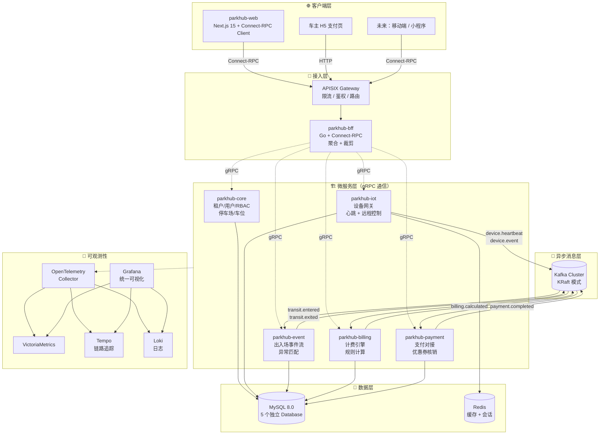

# ParkHub 目标架构详述

> 本文档定义重构完成后的目标架构形态，是阶段 0/1/2 所有任务的对齐基准。
> 配套决策见 [ADR-0001](../adr/0001-migrate-to-microservices.md)。

## 一、架构全景图



## 二、服务详述

### 2.1 parkhub-core（核心域服务）

**职责**：所有其他服务的依赖底座，承载身份认证与基础元数据。

| 子模块 | 说明 |
|--------|------|
| 租户管理 | 租户 CRUD、租户元数据（隔离模式 / 数据库路由） |
| 用户管理 | 用户 CRUD、密码策略 |
| RBAC | 角色、权限、菜单 |
| 认证 | JWT 签发与校验、刷新令牌 |
| 停车场管理 | 停车场、车位、车场配置 |

- **数据库**：`parkhub_core`
- **gRPC 服务**：`core.v1.TenantService`、`core.v1.UserService`、`core.v1.AuthService`、`core.v1.ParkingLotService`
- **被谁依赖**：所有其他服务（鉴权、租户解析、停车场上下文）
- **扩容特征**：低频读、强一致，2-3 个副本足够

### 2.2 parkhub-iot（设备域服务)

**职责**：屏蔽硬件差异，统一闸机/相机接入和命令下发。

| 子模块 | 说明 |
|--------|------|
| 设备注册 | 设备元数据、绑定停车场 |
| 心跳采集 | HTTP/MQTT 心跳接收，状态计算 |
| 远程命令 | 抬杆 / 落杆 / 重启 |
| 协议适配 | 不同厂商闸机协议适配层 |

- **数据库**：`parkhub_iot`（设备元数据） + Redis（实时心跳状态）
- **gRPC 服务**：`iot.v1.DeviceService`、`iot.v1.CommandService`
- **Kafka 生产**：`device.heartbeat`、`device.event`
- **扩容特征**：高频写、长连接，按设备 ID 一致性哈希路由

### 2.3 parkhub-event（事件域服务）

**职责**：承接出入场事件流，实现「有入无出/有出无入」等异常匹配。

| 子模块 | 说明 |
|--------|------|
| 入场事件 | 车牌识别 → 创建入场记录 |
| 出场事件 | 车牌识别 → 匹配入场 → 触发计费 |
| 异常匹配 | 定时扫描、补偿、人工介入 |
| 实时监控 | 当前在场车辆视图 |

- **数据库**：`parkhub_event`（**按月分区表**）
- **gRPC 服务**：`event.v1.TransitService`、`event.v1.MonitorService`
- **Kafka 消费**：`device.event`
- **Kafka 生产**：`transit.entered`、`transit.exited`、`transit.unmatched`
- **扩容特征**：高频写多读，需要时序数据优化

### 2.4 parkhub-billing（计费域服务）

**职责**：纯计算服务，根据规则和时长计算费用，无业务流程。

| 子模块 | 说明 |
|--------|------|
| 规则管理 | 计费规则 CRUD（JSON 列存储） |
| 费用计算 | 多段计费、阶梯费率 |
| 优惠券计算 | 折扣应用、叠加规则 |
| 试算接口 | 提供给前端预览 |

- **数据库**：`parkhub_billing`
- **gRPC 服务**：`billing.v1.RuleService`、`billing.v1.CalculatorService`
- **Kafka 消费**：`transit.exited`
- **Kafka 生产**：`billing.calculated`
- **扩容特征**：CPU 密集，可水平扩展

### 2.5 parkhub-payment（支付域服务）

**职责**：对接外部支付网关，处理订单和回调。

| 子模块 | 说明 |
|--------|------|
| 订单管理 | 订单创建、状态机 |
| 支付对接 | 微信支付、支付宝等 |
| 优惠券核销 | 核销记录、防重复 |
| 对账 | 与支付平台对账 |

- **数据库**：`parkhub_payment`
- **gRPC 服务**：`payment.v1.OrderService`、`payment.v1.PaymentService`
- **Kafka 消费**：`billing.calculated`
- **Kafka 生产**：`payment.completed`、`payment.failed`
- **扩容特征**：低频但高可用，2-3 个副本 + 完整重试

### 2.6 parkhub-bff（前端聚合层）

**职责**：为前端提供按视图聚合的接口，避免前端瀑布请求。

**典型聚合场景**：

| BFF 接口 | 内部调用 |
|----------|---------|
| `GetMonitorDashboard` | `iot.DeviceService.List` + `event.TransitService.ListInProgress` + `event.MonitorService.GetStats` |
| `GetParkingLotDetail` | `core.ParkingLotService.Get` + `iot.DeviceService.ListByLot` + `event.MonitorService.GetLotStats` |
| `GetExitOrder` | `event.TransitService.GetExit` + `billing.CalculatorService.Calculate` + `payment.OrderService.Create` |

- **不持有数据**，只做聚合 + 协议转换
- **对外**：Connect-RPC（HTTP+JSON 或 HTTP/2+Protobuf）
- **对内**：gRPC 调用其他微服务

## 三、目录结构（重构后）

```
parkhub-api/
├── api/
│   └── proto/                          # 🆕 所有 Proto 契约
│       ├── core/v1/
│       │   ├── tenant.proto
│       │   ├── user.proto
│       │   ├── auth.proto
│       │   └── parking_lot.proto
│       ├── iot/v1/
│       │   ├── device.proto
│       │   └── command.proto
│       ├── event/v1/
│       │   ├── transit.proto
│       │   └── monitor.proto
│       ├── billing/v1/
│       │   ├── rule.proto
│       │   └── calculator.proto
│       ├── payment/v1/
│       │   ├── order.proto
│       │   └── payment.proto
│       └── bff/v1/                     # BFF 对外接口
│           ├── monitor.proto
│           ├── parking_lot.proto
│           └── exit_flow.proto
├── buf.yaml                            # 🆕 buf 配置
├── buf.gen.yaml                        # 🆕 buf 生成配置
├── cmd/                                # 🆕 多入口
│   ├── monolith/main.go                #     单进程跑所有 domain（开发/阶段 0-1）
│   ├── core/main.go                    #     独立启动 core
│   ├── iot/main.go                     #     独立启动 iot
│   ├── event/main.go
│   ├── billing/main.go
│   ├── payment/main.go
│   └── bff/main.go
├── internal/
│   ├── domains/                        # 🆕 按业务域组织
│   │   ├── core/
│   │   │   ├── domain/                 #   实体、值对象、枚举
│   │   │   ├── service/                #   业务逻辑（实现 gRPC Server）
│   │   │   ├── repository/             #   持久化（强制 WithTenant）
│   │   │   └── grpc/                   #   gRPC Server 包装
│   │   ├── iot/        (同上结构)
│   │   ├── event/      (同上结构)
│   │   ├── billing/    (同上结构)
│   │   └── payment/    (同上结构)
│   ├── bff/                            # 🆕 BFF 聚合逻辑
│   │   ├── monitor/
│   │   ├── parking_lot/
│   │   └── exit_flow/
│   ├── pkg/                            # 共享基础设施
│   │   ├── tenant/                     # 🆕 租户上下文 + ORM 中间件
│   │   ├── grpcx/                      # 🆕 gRPC 客户端/服务端封装
│   │   ├── kafkax/                     # 🆕 Kafka 生产/消费封装
│   │   ├── otelx/                      # 🆕 OpenTelemetry 初始化
│   │   ├── jwt/
│   │   ├── db/                         # 数据库连接池（按 domain 区分）
│   │   └── ...
│   └── gen/                            # 🆕 buf 生成的代码（gitignore）
│       └── proto/...
├── migrations/                         # 🆕 按 domain 分组
│   ├── core/
│   ├── iot/
│   ├── event/
│   ├── billing/
│   └── payment/
├── deploy/                             # 🆕 部署配置
│   ├── docker/
│   │   ├── Dockerfile.core
│   │   ├── Dockerfile.iot
│   │   └── ...
│   └── k8s/
│       ├── core/
│       ├── iot/
│       └── ...
└── docs/
    ├── adr/
    ├── refactor/
    └── ...
```

## 四、Proto 设计规范

### 4.1 文件组织

- 每个 domain 对应 `api/proto/<domain>/v1/` 目录
- 一个资源（Resource）一个 `.proto` 文件
- 命名使用 `snake_case.proto`
- 包名：`parkhub.<domain>.v1`

### 4.2 命名约定

| 元素 | 规范 | 示例 |
|------|------|------|
| Service | `<Resource>Service` | `TenantService` |
| RPC 方法 | 动词 + 资源 | `GetTenant`、`ListTenants`、`CreateTenant` |
| Request | `<Method>Request` | `GetTenantRequest` |
| Response | `<Method>Response` | `GetTenantResponse` |
| 枚举值 | 全大写 + 前缀 | `TENANT_STATUS_ACTIVE` |

### 4.3 强制规则

- ✅ 所有字段必须有显式 `field number`
- ✅ 删除字段必须用 `reserved` 保留 number
- ✅ 资源 ID 类型统一 `string`（UUID）
- ✅ 时间字段统一 `google.protobuf.Timestamp`
- ✅ 分页统一 `int32 page = 1; int32 page_size = 2;`
- ✅ 所有 RPC Request 必须包含 `string tenant_id = 1;`（除平台管理员接口）
- ❌ 禁止使用 `optional`（用 `oneof` 或显式默认值表达）
- ❌ 禁止跨 domain import proto 文件，需要时通过 `common.v1` 共享

### 4.4 buf 工具链

```yaml
# buf.yaml
version: v2
modules:
  - path: api/proto
lint:
  use:
    - STANDARD
breaking:
  use:
    - FILE
```

```yaml
# buf.gen.yaml
version: v2
plugins:
  - remote: buf.build/protocolbuffers/go
    out: internal/gen/proto
    opt: paths=source_relative
  - remote: buf.build/grpc/go
    out: internal/gen/proto
    opt: paths=source_relative
  - remote: buf.build/connectrpc/go
    out: internal/gen/proto
    opt: paths=source_relative
```

### 4.5 示例：core/v1/tenant.proto

```protobuf
syntax = "proto3";

package parkhub.core.v1;

import "google/protobuf/timestamp.proto";

option go_package = "github.com/parkhub/parkhub-api/internal/gen/proto/core/v1;corev1";

service TenantService {
  rpc GetTenant(GetTenantRequest) returns (GetTenantResponse);
  rpc ListTenants(ListTenantsRequest) returns (ListTenantsResponse);
  rpc CreateTenant(CreateTenantRequest) returns (CreateTenantResponse);
  rpc UpdateTenant(UpdateTenantRequest) returns (UpdateTenantResponse);
  rpc FreezeTenant(FreezeTenantRequest) returns (FreezeTenantResponse);
}

enum TenantStatus {
  TENANT_STATUS_UNSPECIFIED = 0;
  TENANT_STATUS_ACTIVE = 1;
  TENANT_STATUS_FROZEN = 2;
}

enum IsolationMode {
  ISOLATION_MODE_UNSPECIFIED = 0;
  ISOLATION_MODE_POOL = 1;       // 共享实例 + 共享 schema
  ISOLATION_MODE_BRIDGE = 2;     // 共享实例 + 独立 database
  ISOLATION_MODE_SILO = 3;       // 独立实例
}

message Tenant {
  string id = 1;
  string company_name = 2;
  string contact_name = 3;
  string contact_phone = 4;
  TenantStatus status = 5;
  IsolationMode isolation_mode = 6;
  google.protobuf.Timestamp created_at = 7;
  google.protobuf.Timestamp updated_at = 8;
}

message GetTenantRequest {
  string id = 1;
}

message GetTenantResponse {
  Tenant tenant = 1;
}
```

## 五、数据库分库设计

### 5.1 物理布局

```
MySQL 实例 (单实例，未来可拆)
├── parkhub_core
│   ├── tenants
│   ├── users
│   ├── roles
│   ├── permissions
│   ├── parking_lots
│   └── parking_spaces
├── parkhub_iot
│   ├── devices
│   ├── device_heartbeats         # 高频写，独立表
│   └── device_commands
├── parkhub_event
│   ├── transit_records           # 按月分区
│   └── transit_exceptions
├── parkhub_billing
│   ├── billing_rules             # JSON 列 + 虚拟生成列索引
│   └── coupons
└── parkhub_payment
    ├── orders
    ├── payments
    └── coupon_usages
```

### 5.2 跨库查询禁令

⚠️ **跨 database 的 SQL JOIN 严格禁止**。理由：
- 一旦 MySQL 实例物理拆分，所有跨库 JOIN 立刻失效
- 跨域数据聚合必须走 BFF 层或 Kafka 事件同步

### 5.3 租户字段约束

- 所有业务表必须有 `tenant_id VARCHAR(36) NOT NULL`
- 索引必须以 `tenant_id` 开头：`KEY idx_tenant_xxx (tenant_id, ...)`
- 例外：`parkhub_core.tenants` 自身、平台级配置表

### 5.4 时序表分区示例

```sql
CREATE TABLE transit_records (
    id VARCHAR(36) NOT NULL,
    tenant_id VARCHAR(36) NOT NULL,
    parking_lot_id VARCHAR(36) NOT NULL,
    plate_number VARCHAR(20) NOT NULL,
    entered_at TIMESTAMP NOT NULL,
    exited_at TIMESTAMP NULL,
    PRIMARY KEY (id, entered_at),
    KEY idx_tenant_lot_entered (tenant_id, parking_lot_id, entered_at)
) ENGINE=InnoDB
PARTITION BY RANGE (UNIX_TIMESTAMP(entered_at)) (
    PARTITION p202604 VALUES LESS THAN (UNIX_TIMESTAMP('2026-05-01')),
    PARTITION p202605 VALUES LESS THAN (UNIX_TIMESTAMP('2026-06-01')),
    PARTITION p202606 VALUES LESS THAN (UNIX_TIMESTAMP('2026-07-01')),
    PARTITION pmax    VALUES LESS THAN MAXVALUE
);
```

## 六、租户隔离实现

### 6.1 三层防御模型

```
第 1 层：ORM 中间件强制注入
  └─ Repository 基类 WithTenant() 自动追加 WHERE tenant_id=?

第 2 层：自定义 Linter 静态检查
  └─ CI 阶段扫描所有 db.Raw / db.Exec 调用
  └─ 未走 WithTenant() 的代码 PR 不能合并

第 3 层：单元测试强制覆盖
  └─ 每个 Repository 必须有跨租户隔离测试用例
  └─ 测试数据准备 A/B 两个租户，验证 A 查不到 B 的数据
```

### 6.2 代码示例

```go
// internal/pkg/tenant/context.go
type ctxKey struct{}

type TenantInfo struct {
    ID              string
    IsolationMode   string
    IsPlatformAdmin bool
}

func FromContext(ctx context.Context) (TenantInfo, bool) {
    info, ok := ctx.Value(ctxKey{}).(TenantInfo)
    return info, ok
}

// internal/pkg/db/base_repo.go
type BaseRepo struct {
    db *gorm.DB
}

// WithTenant 强制注入租户过滤，所有查询必须经过此方法
func (r *BaseRepo) WithTenant(ctx context.Context) *gorm.DB {
    info, ok := tenant.FromContext(ctx)
    if !ok {
        panic("tenant context missing — refusing query")
    }
    if info.IsPlatformAdmin {
        return r.db.WithContext(ctx) // 平台管理员不过滤
    }
    if info.ID == "" {
        panic("tenant_id empty for non-admin — refusing query")
    }
    return r.db.WithContext(ctx).Where("tenant_id = ?", info.ID)
}
```

### 6.3 平台管理员白名单

某些接口（如租户管理）必须能跨租户访问：
- 通过 gRPC interceptor 检查 JWT 中的 role
- 仅 `platform_admin` 角色的请求会被注入 `IsPlatformAdmin: true` 的 TenantInfo
- 这些接口在 proto 中用注解标记

## 七、Kafka Topic 设计

### 7.1 命名规范

```
<domain>.<resource>.<action>

示例:
  iot.device.heartbeat       — IoT 设备心跳
  iot.device.event           — IoT 设备事件
  event.transit.entered      — 入场事件
  event.transit.exited       — 出场事件
  event.transit.unmatched    — 异常匹配
  billing.calculated         — 计费完成
  payment.completed          — 支付完成
  payment.failed             — 支付失败
```

### 7.2 分区策略

| Topic | 分区数 | 分区键 | 说明 |
|-------|:------:|--------|------|
| `iot.device.heartbeat` | 16 | `device_id` | 同设备保持顺序 |
| `iot.device.event` | 16 | `device_id` | 同设备保持顺序 |
| `event.transit.*` | 8 | `parking_lot_id` | 同停车场保持顺序 |
| `billing.calculated` | 4 | `transit_id` | |
| `payment.completed` | 4 | `order_id` | |

### 7.3 消息格式

统一使用 **Protobuf 序列化**（与 gRPC 共用一份 schema）：

```protobuf
// api/proto/event/v1/events.proto
message TransitEnteredEvent {
  string event_id = 1;        // 事件 ID（去重用）
  string tenant_id = 2;
  string parking_lot_id = 3;
  string plate_number = 4;
  google.protobuf.Timestamp entered_at = 5;
  string device_id = 6;
  google.protobuf.Timestamp emitted_at = 99;  // 事件发出时间
}
```

### 7.4 消费者组规范

- 消费者组命名：`<service-name>.<purpose>`，如 `parkhub-billing.calculator`
- 每个服务订阅的 topic 集合在代码中显式声明
- 消费失败的消息进入 DLQ（Dead Letter Queue）：`<topic>.dlq`

## 八、可观测性

### 8.1 三大支柱集成

```
所有服务
  └─ OpenTelemetry SDK
       ├─ Metrics → OTLP → VictoriaMetrics → Grafana
       ├─ Traces  → OTLP → Tempo           → Grafana
       └─ Logs    → OTLP → Loki            → Grafana
```

### 8.2 必备指标

每个服务必须暴露：

| 类别 | 指标 | 说明 |
|------|------|------|
| RED | `request_total` | 按 method 维度计数 |
| RED | `request_duration_seconds` | P50/P95/P99 |
| RED | `request_error_total` | 错误计数 |
| 业务 | `domain_specific_*` | 各 domain 自定义业务指标 |

### 8.3 Trace 传播

- gRPC 调用通过 OTel interceptor 自动传播 trace context
- Kafka 消息在 header 中携带 trace context（`traceparent`）
- 所有日志必须打印 `trace_id` 字段

## 九、与现有架构的差异总结

| 维度 | 当前单体 | 目标架构 |
|------|---------|---------|
| 进程 | 1 个 | 6 个（5 服务 + BFF） |
| 数据库 | 1 个 database | 5 个 database |
| 通信 | 函数调用 | gRPC + Kafka |
| 前后端协议 | REST/JSON | Connect-RPC |
| 部署 | Docker Compose | Kubernetes |
| 租户隔离 | 应用层 WHERE | ORM 中间件 + Linter + 单测 |
| 配置 | 环境变量 | K8s ConfigMap + Secret |
| 可观测性 | 基础日志 | Metrics + Traces + Logs 三件套 |
| 消息 | 无 | Kafka 异步流转 |

## 十、待决项

以下设计点将在阶段 0 启动前通过后续 ADR 落地：

- [ ] **ADR-0002**：Connect-RPC 在 Next.js 中的具体使用方式（是否经 BFF 二次包装）
- [ ] **ADR-0003**：Saga / Outbox Pattern 选型，处理「出场 → 计费 → 支付 → 抬杆」长事务
- [ ] **ADR-0004**：租户元数据路由表设计，支持 Bridge/Silo 模式
- [ ] **ADR-0005**：Kafka 完整 Topic 列表与 Schema 演进策略
- [ ] **ADR-0006**：MySQL 未来水平拆分预案（ShardingSphere / Vitess / 手工分片）
