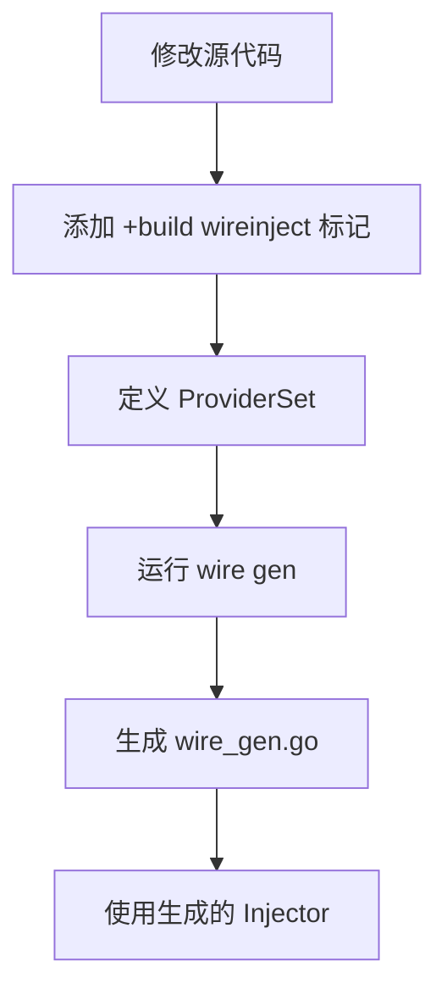

# Wire 依赖注入完整指南

本文档详细介绍 ParkHub API 中 Google Wire 的使用方法，包括安装、配置、最佳实践和测试示例。

## Wire 简介

Wire 是一个代码生成器，用于自动编译依赖注入代码：
- 通过解析代码中的 `wire:""` 标签识别依赖
- 生成 `wire_gen.go` 文件包含依赖注入代码
- 避免手动编写大量的构造函数

## 安装 Wire

```bash
# 安装 Wire 命令行工具
go install github.com/google/wire/cmd/wire@latest

# 验证安装
wire -version
```

## 项目依赖

在 `go.mod` 中添加：

```go
require (
    github.com/google/wire v0.6.0
)
```

## Wire Provider 定义

在服务、仓储等包中定义 Provider 函数：

```go
// internal/repository/impl/user_repo.go

// +build wireinject

// ProviderSet 返回该包提供的所有 providers
var ProviderSet = wire.NewSet(NewUserRepository)

// +build wireinject 标记告诉 Wire 这是需要注入的构造函数
func NewUserRepository(db *sql.DB) repository.UserRepository {
    return &userRepository{
        db: db,
    }
}
```

```go
// internal/service/impl/auth_service.go

// +build wireinject

// 引入其他包的 ProviderSet
var ProviderSet = wire.NewSet(
    NewAuthService,
    repository.ProviderSet,  // 引入仓储 providers
    pkg.ProviderSet,          // 引入 pkg providers (如 JWT)
)
```

```go
// internal/handler/auth_handler.go

// +build wireinject

var ProviderSet = wire.NewSet(NewAuthHandler)
```

## Wire Injector 设置

创建 `internal/wire/wire.go` 文件定义依赖注入配置：

```go
// +build wireinject

package wire

import (
    "github.com/google/wire"
    "github.com/parkhub/api/internal/handler"
    "github.com/parkhub/api/internal/router"
    "github.com/parkhub/api/internal/service"
    "github.com/parkhub/api/internal/repository"
    "github.com/parkhub/api/internal/pkg"
)

// InitializeWire 初始化 wire 生成器
func InitializeWire() (*wire.ProviderSet, error) {
    wire.Build(
        // 引入各层的 ProviderSet
        repository.ProviderSet,
        service.ProviderSet,
        handler.ProviderSet,
        pkg.ProviderSet,
    )
}
```

## 生成 Wire 代码

```bash
# 在 parkhub-api 目录下运行 wire 命令
wire gen ./internal/wire

# 生成文件
# internal/wire/wire_gen.go - 生成的依赖注入代码
# internal/wire/wire.go - wire 配置文件（已有）

# Wire 命令选项
wire gen ./internal/wire          # 生成代码
wire check ./internal/wire         # 检查依赖图
wire diff ./internal/wire          # 查看差异
```

## 生成的代码示例

Wire 会自动生成类似以下的代码：

```go
// Code generated by Wire; DO NOT EDIT.

//go:build !wireinject

package wire

import (
    "github.com/parkhub/api/internal/handler"
    "github.com/parkhub/api/internal/pkg"
    "github.com/parkhub/api/internal/repository"
    "github.com/parkhub/api/internal/service"
)

func injectAuthHandler() *handler.AuthHandler {
    db := getDB()
    jwtManager := getJWTManager()
    userRepo := repository.NewUserRepository(db)
    refreshTokenRepo := repository.NewRefreshTokenRepository(db)
    smsCodeRepo := repository.NewSmsCodeRepository(db)
    authService := service.NewAuthService(userRepo, jwtManager, refreshTokenRepo, smsCodeRepo)
    return handler.NewAuthHandler(authService)
}

func initializeRouter() *router.Router {
    db := getDB()
    jwtManager := getJWTManager()
    userRepo := repository.NewUserRepository(db)
    authService := service.NewAuthService(...)
    return router.NewRouter(gin.New(), jwtManager, authService)
}
```

## 使用生成的 Injector

在 `cmd/server/main.go` 中使用生成的注入器：

```go
// cmd/server/main.go

package main

import (
    "github.com/parkhub/api/internal/wire"
    "github.com/parkhub/api/internal/router"
    "github.com/parkhub/api/internal/pkg"
    "github.com/gin-gonic/gin"
)

func main() {
    // 初始化依赖注入
    providerSet, err := wire.InitializeWire()
    if err != nil {
        panic(err)
    }

    // 获取路由器（所有依赖已注入）
    r := router.NewRouter(
        gin.New(),
        providerSet.JWTManager,
        providerSet.AuthService,
    )

    // 设置路由
    r.Setup()

    // 启动服务器
    if err := r.engine.Run(":8080"); err != nil {
        panic(err)
    }
}
```

## 额外的 Providers

对于非依赖数据库的配置，需要额外定义 Provider：

```go
// internal/pkg/providers.go

// +build wireinject

package pkg

import (
    "github.com/parkhub/api/internal/config"
    "github.com/parkhub/api/internal/pkg/jwt"
)

var ProviderSet = wire.NewSet(
    NewJWTManager,
    NewConfigProvider,
    // 其他共享工具的 providers...
)
```

## Wire 工作流程



## Wire 标签参考

| 标签 | 用途 | 示例 |
|-------|------|------|
| `// +build wireinject` | 标记文件需要 Wire 处理 | 文件顶部添加 |
| `wire:""` | 命名依赖（不推荐） | `wire:"db"` |
| `wire.NewSet()` | 创建 Provider 集合 | `wire.NewSet(NewA, NewB)` |

**推荐使用 `ProviderSet` 而非命名 wire 标签**，这样可以批量管理依赖。

## 常见问题

**Q: 运行 wire gen 后编译报错？**
```bash
# 确保生成的 wire_gen.go 被包含在构建中
go build ./cmd/server

# 如果还是报错，可以尝试清理缓存
wire check ./internal/wire
rm internal/wire/wire_gen.go
wire gen ./internal/wire
```

**Q: 如何添加新的依赖？**
```go
// 1. 在目标构造函数中添加新参数
func NewAuthService(
    userRepo repository.UserRepository,
    jwtManager *jwt.JWTManager,
    tokenRepo repository.RefreshTokenRepository,  // 新增
    smsCodeRepo repository.SmsCodeRepository, // 新增
) service.AuthService {
    // ...
}

// 2. 重新运行 wire gen
wire gen ./internal/wire

// Wire 会自动检测并注入新依赖
```

## Makefile 集成

在 Makefile 中集成 Wire 命令：

```makefile
# Makefile

.PHONY: wire build run clean

# 生成 Wire 代码
wire:
    wire gen ./internal/wire

# 构建项目
build: wire
    go build -o bin/server ./cmd/server

# 运行服务器
run: build
    ./bin/server

# 清理生成文件
clean-wire:
    rm internal/wire/wire_gen.go

clean:
    rm -rf bin/
```

---

# 面向接口编程

## 核心原则

ParkHub API 遵循面向接口编程（DIP）原则，依赖抽象而非具体实现：

- **服务层依赖仓储接口**：Service 依赖 `Repository` 接口，而非具体实现
- **处理器依赖服务接口**：Handler 依赖 `Service` 接口，而非具体实现
- **中间件依赖抽象**：中间件依赖配置接口，而非硬编码

## 接口定义示例

```go
// internal/repository/interface.go - 定义数据访问契约
type UserRepository interface {
    FindByID(ctx context.Context, id string) (*domain.User, error)
    FindByUsername(ctx context.Context, username string) (*domain.User, error)
    Create(ctx context.Context, user *domain.User) error
    Update(ctx context.Context, user *domain.User) error
}

// internal/service/interface.go - 定义业务逻辑契约
type AuthService interface {
    Login(ctx context.Context, req *LoginRequest) (*LoginResponse, error)
    SendSmsCode(ctx context.Context, req *SendSmsCodeRequest) error
    SmsLogin(ctx context.Context, req *SmsLoginRequest) (*LoginResponse, error)
    RefreshToken(ctx context.Context, refreshToken string) (*LoginResponse, error)
    Logout(ctx context.Context, userID string, refreshToken string) error
    GetCurrentUser(ctx context.Context, userID string) (*domain.User, error)
}
```

## 实现示例

```go
// internal/repository/impl/user_repo.go - 实现仓储接口
type userRepository struct {
    db *sql.DB
}

func NewUserRepository(db *sql.DB) repository.UserRepository {
    return &userRepository{db: db}
}

func (r *userRepository) FindByID(ctx context.Context, id string) (*domain.User, error) {
    var user domain.User
    err := r.db.QueryRowContext(ctx,
        "SELECT id, tenant_id, username, email, phone, password_hash, real_name, role, status, last_login_at, created_at, updated_at FROM users WHERE id = ?",
        id).Scan(&user.ID, &user.TenantID, &user.Username, &user.Email, &user.Phone, &user.PasswordHash, &user.RealName, &user.Role, &user.Status, &user.LastLoginAt, &user.CreatedAt, &user.UpdatedAt)
    return &user, err
}

// internal/service/impl/auth_service.go - 实现服务接口
type authService struct {
    userRepo   repository.UserRepository
    jwtManager *jwt.JWTManager
    // 通过 Wire 注入，非手动创建
    tokenRepo  repository.RefreshTokenRepository
    smsCodeRepo repository.SmsCodeRepository
}

func NewAuthService(userRepo repository.UserRepository, jwtManager *jwt.JWTManager, tokenRepo repository.RefreshTokenRepository, smsCodeRepo repository.SmsCodeRepository) service.AuthService {
    return &authService{
        userRepo:   userRepo,
        jwtManager: jwtManager,
        tokenRepo:  tokenRepo,
        smsCodeRepo: smsCodeRepo,
    }
}

// 依赖的是接口，可轻松替换实现进行测试
func (s *authService) Login(ctx context.Context, req *LoginRequest) (*LoginResponse, error) {
    // 调用仓储接口方法
    user, err := s.userRepo.FindByUsername(ctx, req.Account)
    if err != nil {
        if errors.Is(err, sql.ErrNoRows) {
            return nil, domain.ErrUserNotFound
        }
        return nil, err
    }
    // 业务逻辑...
}
```

## 测试与 Mock

```go
// 使用接口便于创建 Mock
type mockUserRepository struct {
    users []*domain.User
}

func (m *mockUserRepository) FindByID(ctx context.Context, id string) (*domain.User, error) {
    for _, u := range m.users {
        if u.ID == id {
            return u, nil
        }
    }
    return nil, domain.ErrUserNotFound
}

// 测试时注入 Mock 而非真实数据库
func TestAuthService_Login(t *testing.T) {
    mockRepo := &mockUserRepository{users: testUsers}
    service := NewAuthService(mockRepo, &mockJWTManager{}, &mockTokenRepo{}, &mockSmsCodeRepo{})

    resp, err := service.Login(context.Background(), &LoginRequest{Account: "test", Password: "pass"})
    assert.NoError(t, err)
    assert.Equal(t, "user-id", resp.User.ID)
}
```

## DIP 的好处

| 好处 | 说明 |
|-------|------|
| **低耦合** | 层级之间通过接口通信，降低耦合度 |
| **可测试性** | 可以轻松创建 Mock 进行单元测试 |
| **可替换性** | 可以替换具体实现而不影响其他代码 |
| **职责清晰** | 每层只依赖需要的接口，职责明确 |
| **自动化** | Wire 自动生成注入代码，减少手动错误 |
